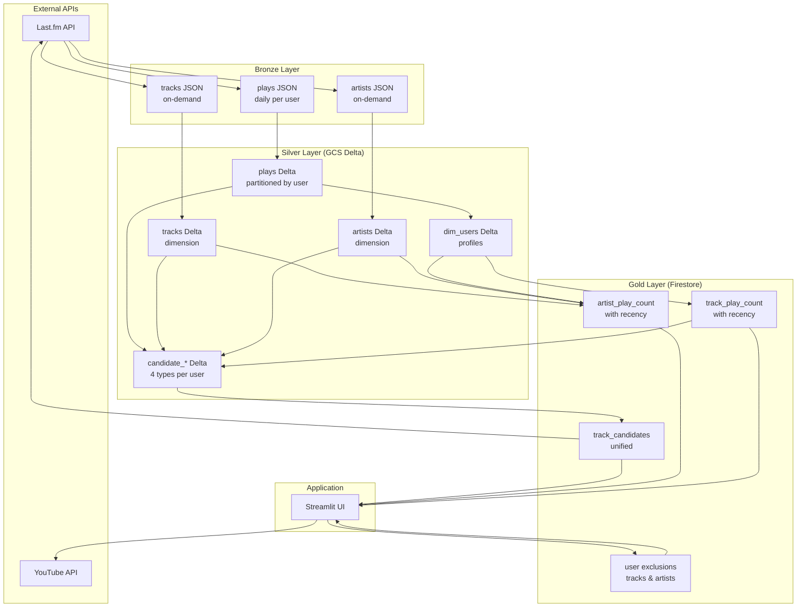

# System Architecture

Music recommendation system built with Apache Airflow 3.0, processing Last.fm listening history through a medallion architecture to generate personalized recommendations.

The system avoids recommendation feedback loops by using exponential decay scoring with per-user half-life values, ensuring a balance between music discovery and forgotten favorites.

## Data Layers

**Bronze**: Raw JSON from Last.fm API

- User play history (daily per user)
- Track metadata (on-demand for new tracks)
- Artist metadata (on-demand for new tracks)

**Silver**: Structured Delta tables (GCS)

- Normalized plays (partitioned by user)
- Track and artist dimensions
- User profiles with computed half-life values
- Four types of recommendation candidates

**Gold**: Firestore (low-latency serving)

- Play counts with recency scores
- Unified track candidates ready for recommendations
- User exclusions (blocked tracks/artists)

## Data Pipeline



## DAG Orchestration

```mermaid
graph LR
    D1[lastfm_plays<br/>@daily] -->|plays asset| D2[candidate_generation<br/>asset-triggered]
    D2 -->|candidates asset| D3[lastfm_dimensions<br/>asset-triggered]
    D3 -->|artists OR tracks OR users| D4[gold_play_aggregations<br/>asset-triggered]

    D4 -->|artist_play_count asset| APP[Streamlit App]
    D4 -->|track_play_count asset| APP
    D2 -->|track_candidates asset| APP
```

**lastfm_plays** (@daily):

- Extracts user listening history
- Builds plays table incrementally with catchup enabled for backfills
- Triggers candidate generation

**backfill_user** (manual trigger):

- Backfills historical play data for a specific user
- Use when adding a new user to the system
- Parameters: username, start_date, end_date
- Processes each day sequentially, respecting API rate limits
- Triggers downstream DAGs via plays asset update

**candidate_generation** (asset-triggered by plays):

- Generates four types of candidates (similar artists, similar tags, deep cuts, old favorites)
- Reads existing track/artist dimensions when available
- Preserves track_name/artist_name from Last.fm API for dimension enrichment
- Writes to gold/track_candidates
- Triggers dimensions DAG

**lastfm_dimensions** (asset-triggered by candidates):

- Discovers new tracks from candidates
- Fetches metadata from Last.fm API
- Searches for "popular version" via `track.search` (most listeners) for reliable streaming links
- Uses YouTube Music API to find audio-only versions (faster, avoids music videos)
- Falls back to scraping Last.fm page for missing YouTube URLs
- Scrapes Last.fm page for Spotify URLs
- Computes user profiles with half-life values from plays data
- Single-cycle enrichment: New tracks discovered by candidates are enriched in the same daily run

**gold_play_aggregations** (asset-triggered by any dimension output):

- Triggered when any dimension asset updates (dim_users OR artists OR tracks)
- Computes play statistics with exponential decay recency scores
- Full refresh since scores are time-dependent

## Recommendation Candidates

Four strategies generate recommendation candidates, each saved to intermediate silver tables before consolidation:

### Similar Artist Candidates

Finds tracks by artists similar to those the user has played.

**Process**:

1. Sample 20% of user's played artists (API efficiency)
2. Call Last.fm `artist.getSimilar` for each
3. Filter out high similarity (>0.9) to avoid duplicates/clones
4. Get top tracks for each similar artist via `artist.getTopTracks`
5. Exclude tracks user already played
6. Score by `artist_similarity × track_popularity`

**Use case**: Discover artists with similar sound to favorites.

### Similar Tag Candidates

Finds tracks matching the user's tag profile (genres, moods, styles).

**Process**:

1. Collect all tags from user's played tracks
2. Count tag frequencies to build profile
3. Call Last.fm `tag.getTopTracks` for top tags
4. Exclude already-played tracks
5. Score by `tag_frequency_in_user_library`

**Use case**: Explore music with familiar characteristics.

### Deep Cut Candidates

Finds obscure tracks from the user's favorite artists.

**Process**:

1. Get user's top artists by play count
2. Fetch top albums for each artist via `artist.getTopAlbums`
3. Get track listings from albums via `album.getInfo`
4. Filter for low-playcount tracks (global Last.fm playcount)
5. Exclude already-played tracks
6. Score by `artist_play_count × track_obscurity`

**Use case**: Discover hidden gems from beloved artists.

### Old Favorites Candidates

Resurfaces tracks the user loved but hasn't played recently (time capsule).

**Process**:

1. Query track play counts from plays table
2. Filter: `play_count >= 3` (was a favorite)
3. Filter: `recency_score_normalized < 0.5` (not recent)
4. Score by `play_count × (1 - recency)`

**Use case**: Rediscover forgotten favorites.

## Key Techniques

### Recency Scoring

Prevents feedback loops where only popular/recent tracks dominate:

```python
# Per-user half-life from listening history span
half_life_days = max(listening_span_days / 10, 30.0)

# Exponential decay for each play
recency_contribution = exp(-days_ago / half_life_days)

# Normalize by play count to prevent rich-get-richer
recency_score_normalized = sum(contributions) / play_count
```

Veterans have gentler decay (~500 days), new users have aggressive decay (~30 days).

### Track ID Generation

Canonical track IDs use text normalization for robust matching across data sources:

```python
track_id = f"{normalize_text(track_name)}|{normalize_text(artist_name)}"
```

**Normalization**:
- Lowercase conversion
- Removal of punctuation, parenthetical notes, and extra whitespace
- Stripping of qualifiers like "(Remastered)", "(Live)", "(feat. X)", years

This ensures consistent joins across track name variations (e.g., "Song" matches "Song (Remastered 2020)").

### Streaming Link Enrichment

Track metadata includes streaming links for playlist generation and playback:

**YouTube URL Resolution** (multi-step with YTMusic primary):

1. **Popular Version Search**: Use Last.fm `track.search` to find the canonical version with most listeners (avoids obscure remasters with no links)
2. **YouTube Music API (Primary)**: Search YouTube Music for audio-only version using ytmusicapi (faster than scraping, filters songs over music videos)
3. **Last.fm Scraping (Fallback)**: If YTMusic fails, scrape the popular version's Last.fm page for embedded YouTube URL

This approach ensures high YouTube URL coverage (~95%+) while preferring audio versions over music videos. YTMusic is primary because:
- It's faster than HTTP scraping
- It filters for audio-only content, avoiding music videos

**Spotify URL**: Scraped from Last.fm track pages when available.

Streaming links are stored in the track dimension table, enabling fast playlist generation without runtime searches.

### Candidate Consolidation

Four silver candidate tables merge into one gold table with one-hot encoding:

```python
# Normalize scores within each source using percentile ranking
# Limit each source to top N tracks (default 500)
# Deduplicate by (username, track_id), aggregate source flags
similar_artist = max(source == "similar_artist")
similar_tag = max(source == "similar_tag")
deep_cut = max(source == "deep_cut")
old_favorite = max(source == "old_favorite")
score = sum(normalized_scores)  # Sum rewards multi-source consensus
```

Tracks can belong to multiple categories simultaneously. Tracks appearing in multiple sources get higher scores (consensus bonus).
