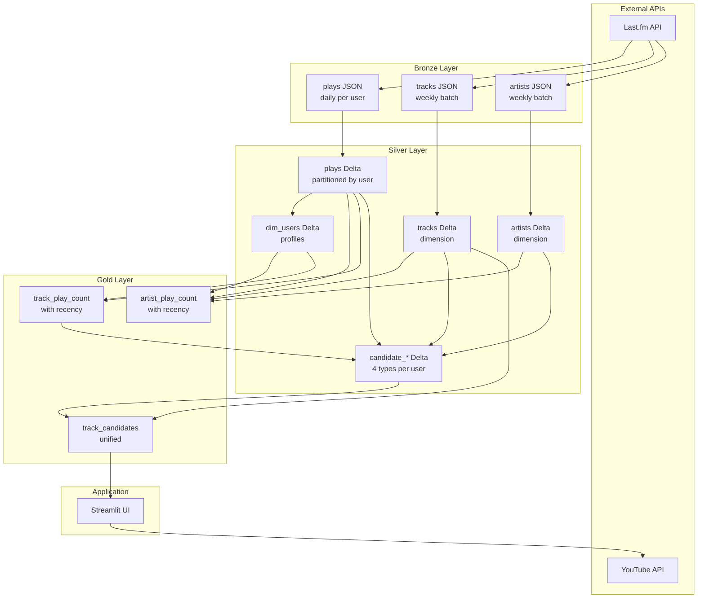

# System Architecture

Music recommendation system built with Apache Airflow 3.0, processing Last.fm listening history through a medallion architecture to generate personalized recommendations.

The system avoids recommendation feedback loops by using exponential decay scoring with per-user half-life values, ensuring a balance between music discovery and forgotten favorites.

## Data Layers

**Bronze**: Raw JSON from Last.fm API

- User play history (daily per user)
- Track metadata (weekly batch for new tracks)
- Artist metadata with similar artists (weekly batch)

**Silver**: Structured Delta tables

- Normalized plays (partitioned by user)
- Track and artist dimensions
- User profiles with computed half-life values
- Four types of recommendation candidates

**Gold**: Business aggregations

- Play counts with recency scores
- Unified track candidates ready for recommendations

## Data Pipeline



## DAG Orchestration

```mermaid
graph LR
    D1[lastfm_plays<br/>@daily] -->|plays asset| D3[gold_play_aggregations<br/>asset-triggered]
    D1 -->|plays asset| D4[candidate_generation<br/>asset-triggered]

    D2[lastfm_dimensions<br/>@weekly] -->|tracks asset| D4
    D2 -->|artists asset| D3
    D2 -->|artists asset| D4
    D2 -->|dim_users asset| D3

    D3 -->|artist_play_count asset| APP[Streamlit App]
    D3 -->|track_play_count asset| APP
    D4 -->|track_candidates asset| APP
```

**lastfm_plays** (@daily):

- Extracts user listening history
- Builds plays table incrementally with catchup enabled for backfills

**lastfm_dimensions** (@weekly):

- Fetches metadata for new tracks/artists
- Computes user dimension table with half-life values

**gold_play_aggregations** (asset-triggered):

- Computes play statistics with exponential decay recency scores
- Full refresh since scores are time-dependent

**candidate_generation** (asset-triggered):

- Generates four types of candidates (similar artists, similar tags, deep cuts, old favorites)
- Consolidates into gold table with type indicators

## Recommendation Candidates

Four strategies generate recommendation candidates, each saved to intermediate silver tables before consolidation:

### Similar Artist Candidates

Finds tracks by artists similar to those the user has played.

**Process**:

1. Sample 20% of user's played artists (API efficiency)
2. Call Last.fm `artist.getSimilar` for each
3. Filter out high similarity (>0.9) to avoid duplicates/clones
4. Get top tracks for each similar artist via `artist.getTopTracks`
5. Exclude tracks user already played
6. Score by `artist_similarity × track_popularity`

**Use case**: Discover artists with similar sound to favorites.

### Similar Tag Candidates

Finds tracks matching the user's tag profile (genres, moods, styles).

**Process**:

1. Collect all tags from user's played tracks
2. Count tag frequencies to build profile
3. Call Last.fm `tag.getTopTracks` for top tags
4. Exclude already-played tracks
5. Score by `tag_frequency_in_user_library`

**Use case**: Explore music with familiar characteristics.

### Deep Cut Candidates

Finds obscure tracks from the user's favorite artists.

**Process**:

1. Get user's top artists by play count
2. Fetch top albums for each artist via `artist.getTopAlbums`
3. Get track listings from albums via `album.getInfo`
4. Filter for low-playcount tracks (global Last.fm playcount)
5. Exclude already-played tracks
6. Score by `artist_play_count × track_obscurity`

**Use case**: Discover hidden gems from beloved artists.

### Old Favorites Candidates

Resurfaces tracks the user loved but hasn't played recently (time capsule).

**Process**:

1. Query track play counts from plays table
2. Filter: `play_count >= 3` (was a favorite)
3. Filter: `recency_score_normalized < 0.5` (not recent)
4. Score by `play_count × (1 - recency)`

**Use case**: Rediscover forgotten favorites.

## Key Techniques

### Recency Scoring

Prevents feedback loops where only popular/recent tracks dominate:

```python
# Per-user half-life from listening history span
half_life_days = max(listening_span_days / 10, 30.0)

# Exponential decay for each play
recency_contribution = exp(-days_ago / half_life_days)

# Normalize by play count to prevent rich-get-richer
recency_score_normalized = sum(contributions) / play_count
```

Veterans have gentler decay (~500 days), new users have aggressive decay (~30 days).

### Track ID Generation

Last.fm API inconsistently returns MBIDs. Stable IDs ensure consistent joins:

```python
track_id = track_mbid if track_mbid else f"{track_name}|{artist_name}"
```

### Candidate Consolidation

Four silver candidate tables merge into one gold table with one-hot encoding:

```python
# Deduplicate by (username, track_id)
similar_artist = any(source == "similar_artist")
similar_tag = any(source == "similar_tag")
deep_cut = any(source == "deep_cut")
old_favorite = any(source == "old_favorite")
score = max(scores_across_sources)
```

Tracks can belong to multiple categories simultaneously.
